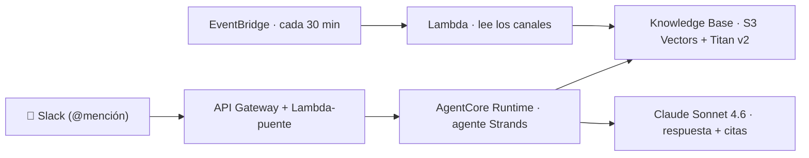

# 💬 Hablá con tu Slack, Teams o lo que uses

> Agentes de IA **serverless** en AWS con **Amazon Bedrock AgentCore** — un agente que
> responde sobre el conocimiento de tu equipo (Slack), con **citas** a los mensajes originales.
>
> _Material de charla + workshop de [Craftech](https://craftech.io) · AWS GenAI._

---

## 🎤 Presentaciones (en vivo)

| | Para quién | Link |
|---|---|---|
| 🏠 **Landing** | elegí cuál abrir | **https://gastonzarate.github.io/agent-core-habla-con-tu-slack/** |
| 🛠️ **Workshop** | técnico, hands-on | [abrir](https://gastonzarate.github.io/agent-core-habla-con-tu-slack/presentation/) |
| 🚀 **Keynote** | negocio / decisores | [abrir](https://gastonzarate.github.io/agent-core-habla-con-tu-slack/presentation-keynote/) |

> Tip: con la presentación abierta, **`F`** = pantalla completa · **`S`** = vista de orador (notas + timer).

---

## 🧩 Qué hace

Le preguntás en lenguaje natural (`@bot ¿qué se decidió del deploy?`) y responde **en el hilo**,
buscando por **significado** en el historial de Slack y citando la fuente. Todo **serverless**,
sobre tu propia cuenta de AWS, **casi sin infraestructura** que mantener.

- 🔎 **RAG** sobre **Bedrock Knowledge Base** (S3 Vectors + Titan Embeddings v2)
- 🤖 Agente **Strands** sobre **AgentCore Runtime** (hosting serverless, sin contenedores)
- 🧠 **Memory** (recuerda la conversación) · 🛡️ **Guardrails** (filtra datos sensibles)
- 🎫 **Jira** opcional (buscar / crear tickets) · 📊 **Observability** y costos de fábrica

---

## 🏗️ Arquitectura



Lo único que escribimos es el **pegamento** (la Lambda-puente); todo lo demás lo gestiona AWS.

---

## 📦 Estructura del repo

```
workshop/              el hands-on paso a paso (código del agente + infra)
presentation/          deck del workshop (reveal.js, offline)
presentation-keynote/  deck de negocio (recorrido guiado por AgentCore)
```

---

## 🚀 Empezar (hands-on)

```bash
git clone https://github.com/gastonzarate/agent-core-habla-con-tu-slack.git
cd agent-core-habla-con-tu-slack/workshop
python3 -m venv .venv && source .venv/bin/activate
pip install -r requirements.txt
```

Después seguí el **[paso a paso del workshop →](workshop/README.md)** (`s0` → `s7`): base vectorial,
Knowledge Base, el agente, deploy a AgentCore, memoria, guardrails y la conexión con Slack.

> Necesitás una cuenta de AWS (`us-east-1`) con **Titan v2** y **Claude Sonnet 4.6** habilitados,
> y una Slack App. Los secretos van en un `.env` (gitignored) — ver `workshop/.env.example`.

---

<sub>Hecho por **Craftech** · consultoría cloud y DevOps sobre AWS · [craftech.io](https://craftech.io)</sub>
